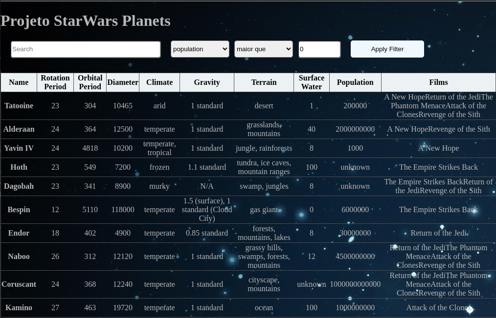

# Starwars Planets Search

This project was developed during the web development course at [Trybe](https://www.betrybe.com/).
The project is a planet database from Star Wars universe. You can see detailed information about planets like population, size, movies it appears, etc...

- <b> The main goal here was to put in practice for the fist time, what i had learned of React Hooks. </b>



## Installation

Clone this repository
```bash
git clone git@github.com:VitorCorrea18/project-starwars-planets-search.git
```
In the project's folder install the dependencies
```bash
npm install
```
Start the project
```bash
npm start
```

- <b>Now it should be running on your default browser</b>

## Usage

> You can search a planet by name, rotation period, orbital period population and etc by using the search bar and filters in dropdown.
> - <b>Maior que</b> : higher then
> - <b>Menor que</b>: lower then
> - <b>Igual a</b>: equal to

<b>Feedbacks are welcome :rocket:</b>
